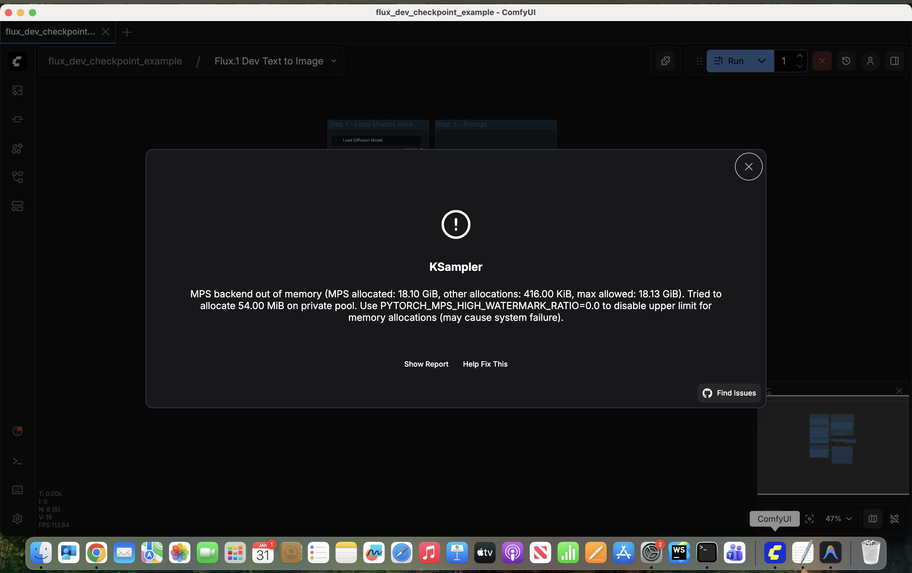
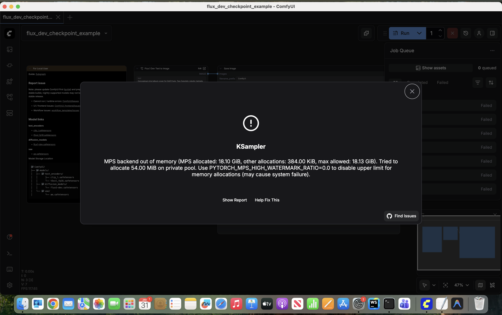
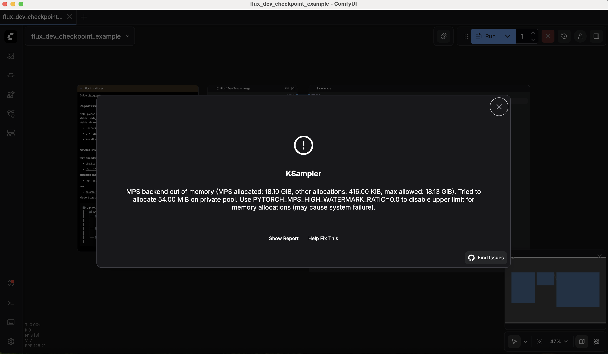

# Generative AI Capstone 2: Art & Media Design
**Student:** Shukhratbek Mamadaliev
**Project Title:** Iconic Media Cover Re-imagination

---

## 1. Book Cover: *1984* by George Orwell

### Original Work

*Description: The classic minimalistic cover featuring the "Big Brother is Watching You" eye.*

### AI-Generated Variation

*Variation: A hyper-realistic brutalist interpretation of total surveillance.*

### Workflow & Technical Details
- **Model:** Flux.1 Dev FP8 (Quantized for Local Deployment)
- **Source:** [Flux.1 Dev on HuggingFace](https://huggingface.co/black-forest-labs/FLUX.1-dev)
- **Hardware:** MacBook Pro M1, 16GB RAM
- **WebUI:** ComfyUI (Local)
- **Parameters:**
  - **Steps:** 25
  - **Sampler:** euler
  - **Scheduler:** simple
  - **CFG:** 1.0
  - **Distilled Guidance:** 3.5
  - **Resolution:** 896 x 1152 (Poster Ratio)

### Prompt
> "A professional book cover for George Orwell's 1984. A massive, hyper-realistic mechanical eye integrated into a brutalist concrete skyscraper. The iris of the eye is a glowing CCTV screen monitor. Cold, cinematic lighting, neon red highlights, dark moody atmosphere. 8k resolution, cinematic grain, dystopian aesthetic."

### Execution Screenshot

---

## 2. Audio Album (Vinyl): *Random Access Memories* by Daft Punk

### Original Work

*Description: The iconic split gold and silver helmets on a black background.*

### AI-Generated Variation

*Variation: Liquid mercury sculptural interpretation of the robotic helmets.*

### Workflow & Technical Details
- **Model:** Flux.1 Dev FP8
- **Hardware:** MacBook Pro M1, 16GB RAM
- **WebUI:** ComfyUI (Local)
- **Parameters:**
  - **Steps:** 20
  - **Sampler:** euler
  - **Scheduler:** beta
  - **CFG:** 1.0
  - **Resolution:** 1024 x 1024 (Square Vinyl)

### Prompt
> "Conceptual vinyl album cover for Daft Punk. Two futuristic robotic helmets partially melted into a pool of liquid iridescent mercury. Reflections of a vibrant sunset and city lights on the chrome surface. Deep black background with fine cosmic dust. High-end product photography, soft studio lighting, sharp focus, 8k, elegant and premium."

### Execution Screenshot

---

## 3. Video (DVD Box): *Interstellar*

### Original Work

*Description: Representative image of an astronaut or the Endurance ship.*

### AI-Generated Variation

*Variation: Celestial event focus featuring the Gargantua black hole.*

### Workflow & Technical Details
- **Model:** Flux.1 Dev FP8
- **Hardware:** MacBook Pro M1, 16GB RAM
- **WebUI:** ComfyUI (Local)
- **Parameters:**
  - **Steps:** 25
  - **Sampler:** euler
  - **Scheduler:** simple
  - **CFG:** 1.0
  - **Resolution:** 832 x 1216 (DVD Ratio)

### Prompt
> "A cinematic DVD cover for the movie Interstellar. A breathtaking close-up of a supermassive black hole 'Gargantua' with a glowing golden accretion disk bending time and space. A tiny, fragile spaceship silhouette in the foreground against the vastness of the cosmos. Hyper-realistic, lens flare, deep blues and glowing golds, IMAX quality, epic scale."

### Execution Screenshot

---

## Resources Used
- **Software:** ComfyUI (v0.10.0)
- **Environment:** Local installation on macOS (Darwin)
- **Acceleration:** Apple Silicon (MPS / Metal Performance Shaders)
- **Model Files:** `flux1-dev-fp8.safetensors`, `ae.safetensors`, `clip_l.safetensors`, `t5xxl_fp8_e4m3fn.safetensors`

---

## Hardware Constraints & Optimization Strategy
Running Flux.1 Dev locally on a **MacBook Pro M1 with 16GB RAM** presents significant memory management challenges. During the initial execution, a `RuntimeError: MPS backend out of memory` was encountered due to the high VRAM requirements of the model and text encoders.

### Challenges Encountered:
- **Unified Memory Bottleneck:** macOS reserves a portion of the 16GB RAM for the system, leaving roughly 12-13GB for the GPU. The full **T5XXL (FP16)** text encoder alone consumes ~10GB, leaving insufficient room for the Flux model (~12GB) and latent processing.
- **KSampler Crashes:** High-resolution generation (1024x1024) caused the MPS backend to exceed its allocation limit (18.13 GiB total including swap), resulting in process termination.

### Optimization Techniques Implemented:
1. **Double Quantization:** 
   - Switched the main model to **Flux.1 Dev FP8**.
   - Replaced the text encoder with **T5XXL FP8 (e4m3fn)**, reducing its memory footprint from 10GB to ~4.8GB.
2. **Weight Offloading:** Configured ComfyUI to offload the CLIP and T5 models to CPU/System RAM immediately after encoding, freeing up the "GPU" (Unified Memory) for the diffusion process.
3. **Resolution Downscaling:** Adjusted generation targets to 896px on the long edge to stay within the safe bounds of the MPS private pool.
4. **Environment Tweaks:** (If applicable) Utilized `PYTORCH_MPS_HIGH_WATERMARK_RATIO=0.0` to prevent the OS from hard-capping memory allocations during peak sampling steps.
