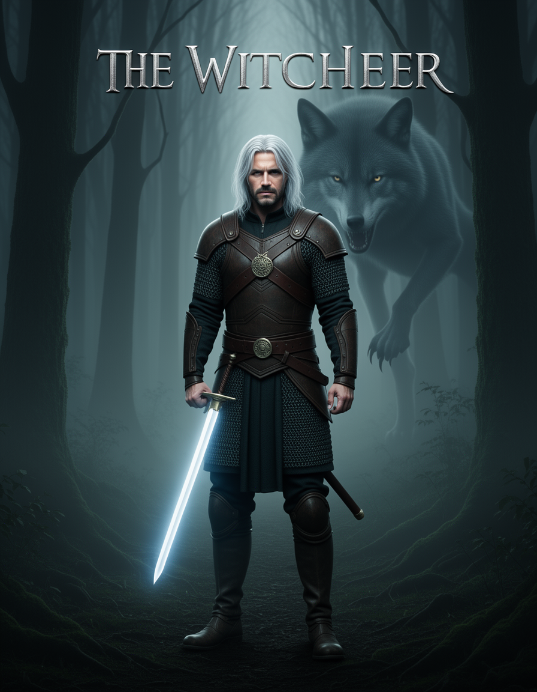
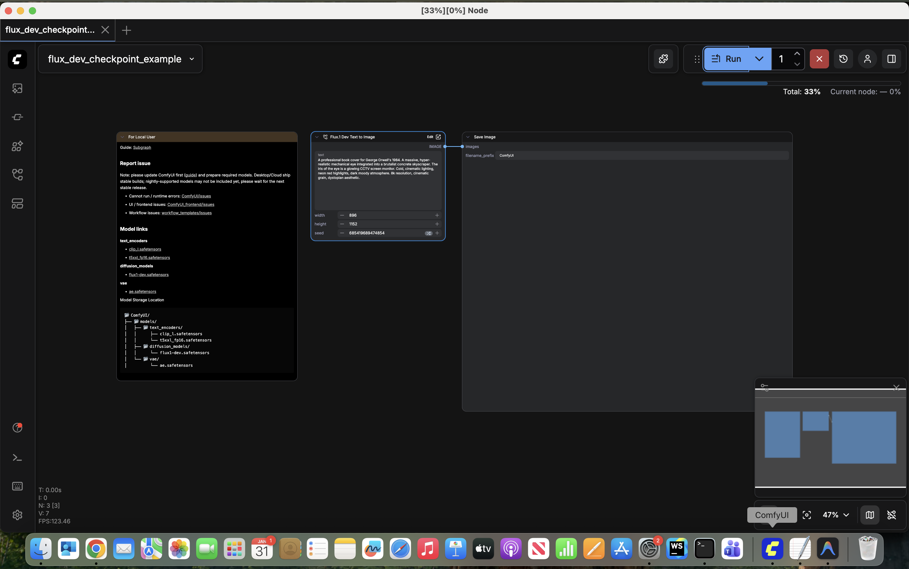
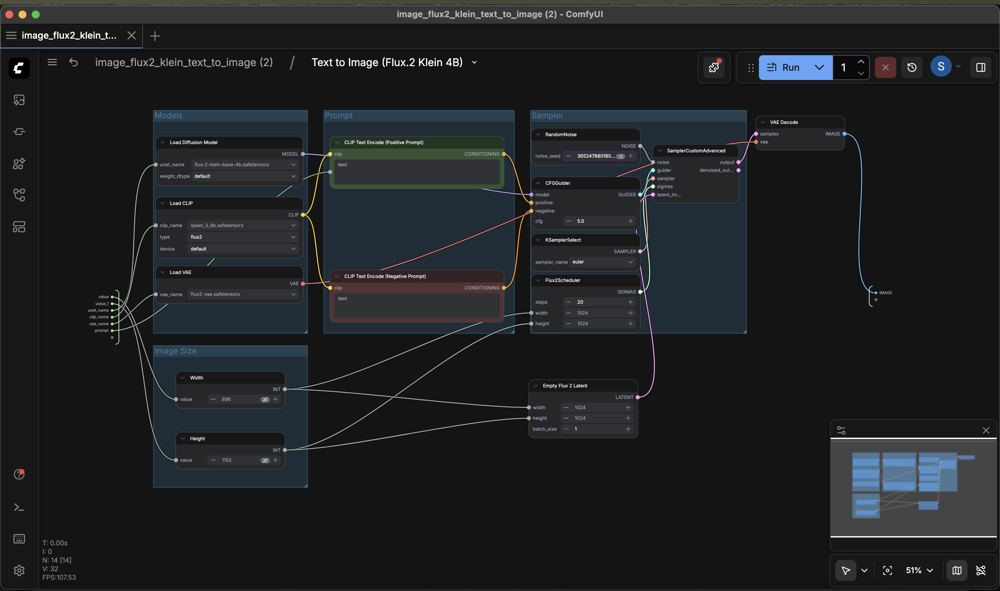
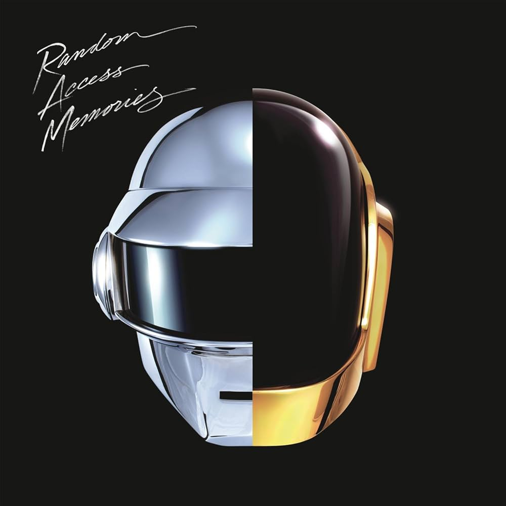
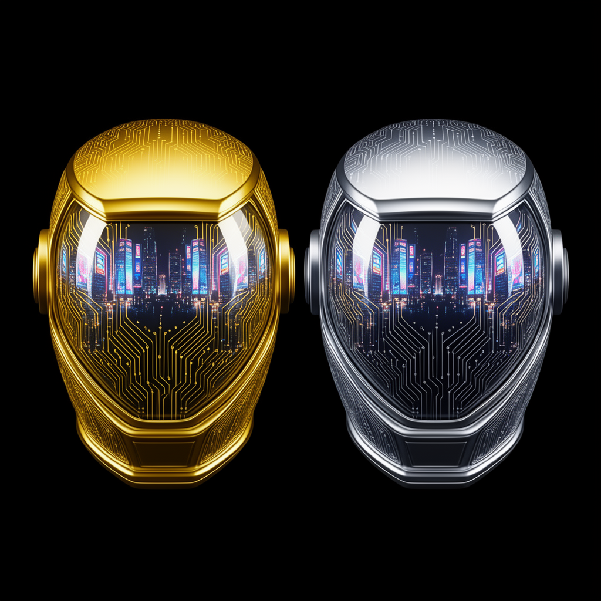
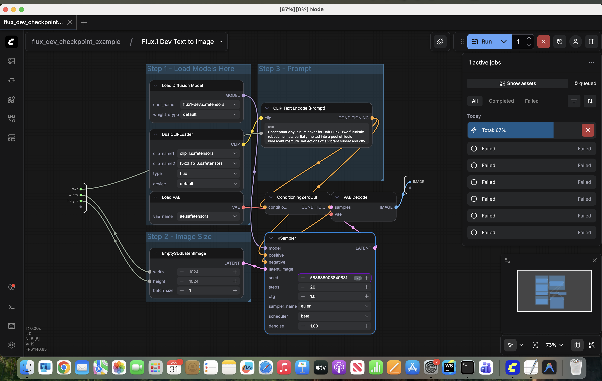
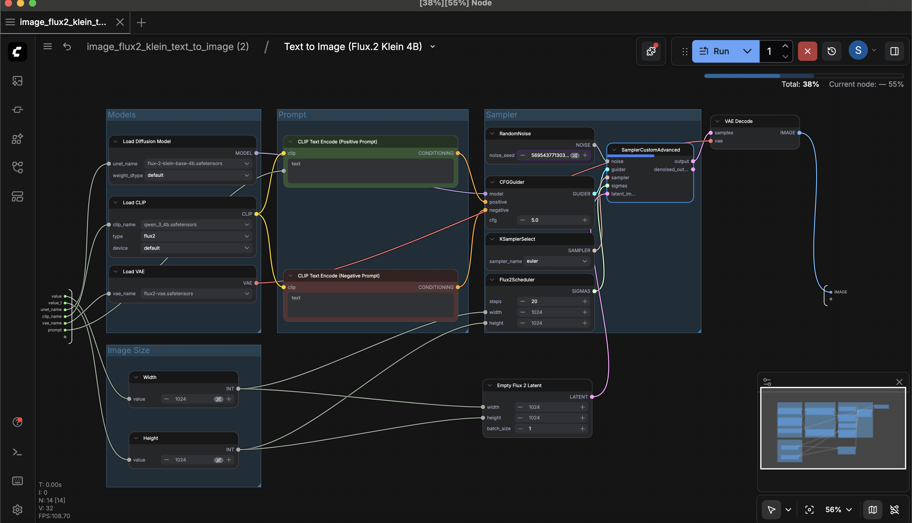
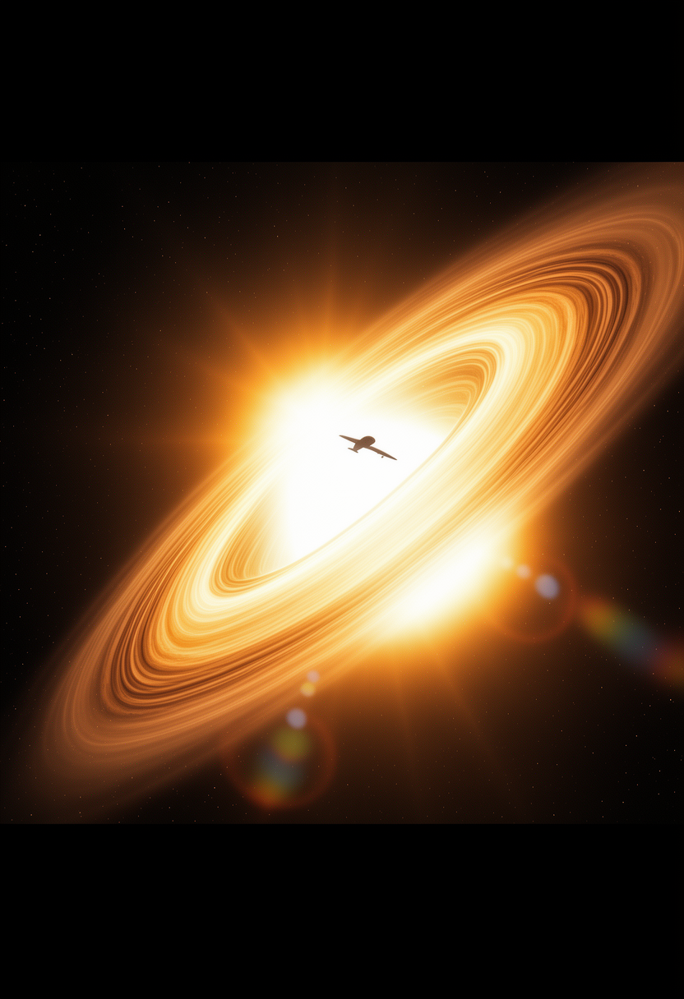
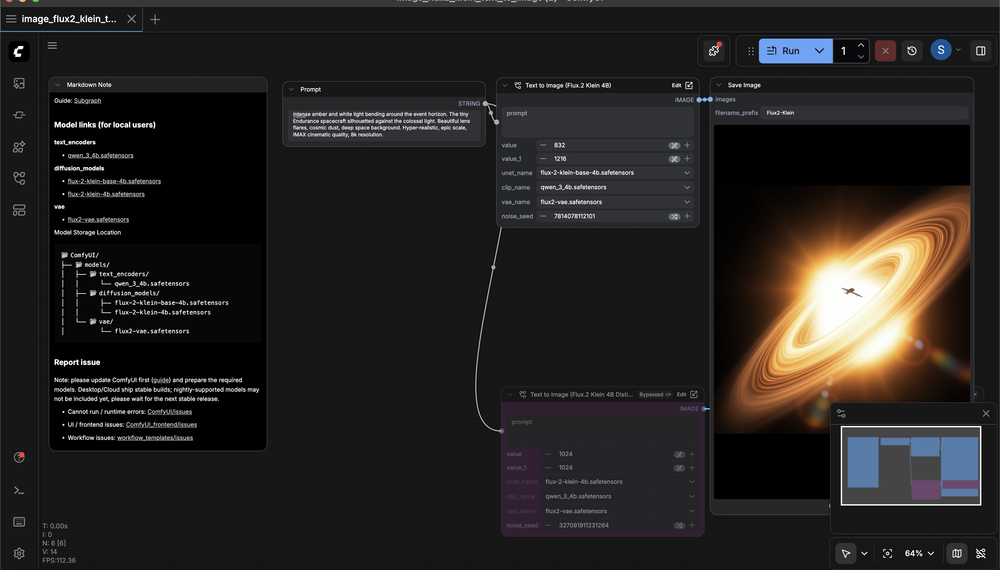
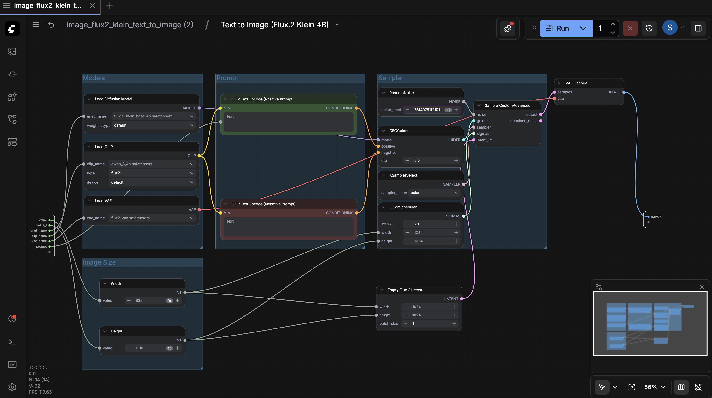

# Generative AI Capstone 2: Art & Media Design
**Student:** Shukhratbek Mamadaliev
**Project Title:** Iconic Media Cover Re-imagination

---

## 1. Book Cover: *The Witcher: The Last Wish* by Andrzej Sapkowski

### Original Work

*Description: The iconic cover featuring the silver wolf medallion and a gritty fantasy aesthetic.*

### AI-Generated Variation

*Variation: A hyper-realistic, cinematic interpretation of Geralt in a monster-infested forest.*

### Workflow & Technical Details
- **Model:** Flux.2 [klein] 4B
- **Source:** [Flux.2 [klein] on HuggingFace](https://huggingface.co/black-forest-labs/FLUX.1-dev-klein) 
- **Hardware:** MacBook Pro M1, 16GB RAM
- **WebUI:** ComfyUI (Local)
- **Parameters:**
  - **Steps:** 20
  - **Sampler:** euler
  - **Scheduler:** simple
  - **CFG:** 5.0
  - **Resolution:** 896 x 1152 (Poster Ratio)

### Prompts
- **Positive:** "A professional book cover for The Witcher. Geralt of Rivia with silver white hair standing in a dark, misty ancient forest. He is holding a glowing silver sword, wearing leather and chainmail armor with a wolf medallion. A terrifying monster silhouette in the background mist. Dark fantasy aesthetic, cinematic lighting, hyper-realistic, 8k resolution, moody atmosphere."

### Execution Screenshot

---

## 2. Audio Album (Vinyl): *Random Access Memories* by Daft Punk

### Original Work

*Description: The iconic split gold and silver helmets on a black background.*

### AI-Generated Variation

*Variation: Liquid mercury sculptural interpretation of the robotic helmets.*

### Workflow & Technical Details
- **Model:** Flux.2 [klein] 4B
- **Hardware:** MacBook Pro M1, 16GB RAM
- **WebUI:** ComfyUI (Local)
- **Parameters:**
  - **Steps:** 20
  - **Sampler:** euler
  - **Scheduler:** simple
  - **CFG:** 5.0
  - **Resolution:** 1024 x 1024 (Square Vinyl)

### Prompts
- **Positive:** "A premium vinyl record cover for Daft Punk's Random Access Memories. Two iconic robotic helmets, one gold and one silver, set against a deep black void. The helmets are glowing with intricate circuitry patterns. Reflections of a futuristic neon city on the polished chrome surfaces. Cinematic studio lighting, sharp focus, high-end product photography, 8k, elegant and premium design."

### Execution Screenshot

---

## 3. Video (DVD Box): *Interstellar*

### Original Work

*Description: Representative image of an astronaut or the Endurance ship.*

### AI-Generated Variation

*Variation: Celestial event focus featuring the Gargantua black hole.*

### Workflow & Technical Details
- **Model:** Flux.2 [klein] 4B
- **Hardware:** MacBook Pro M1, 16GB RAM
- **WebUI:** ComfyUI (Local)
- **Parameters:**
  - **Steps:** 20
  - **Sampler:** euler
  - **Scheduler:** simple
  - **CFG:** 5.0
  - **Resolution:** 832 x 1216 (DVD Ratio)

### Prompts
- **Positive:** "A breathtaking cinematic DVD box cover for the movie Interstellar. The massive, spinning accretion disk of the black hole Gargantua glowing with intense amber and white light bending around the event horizon. The tiny Endurance spacecraft silhouetted against the colossal light. Beautiful lens flares, cosmic dust, deep space background. Hyper-realistic, epic scale, IMAX cinematic quality, 8k resolution."

### Execution Screenshot

---

## Resources Used
- **Software:** ComfyUI (v0.8.2)
- **Environment:** Local installation on macOS (Darwin)
- **Acceleration:** Apple Silicon (MPS / Metal Performance Shaders)
- **Model Files:** `flux-2-klein-base-4b.safetensors`, `qwen_3_4b.safetensors`, `flux2-vae.safetensors`

---

## Hardware Constraints & Optimization Strategy
Running ultra-high-parameter models like Flux.1 Dev locally on a **MacBook Pro M1 with 16GB RAM** revealed critical physical constraints. While the system's "Swap" architecture allows for over-allocation, the extreme size of Flux (12-24GB) leads to frequent backend timeouts and system instability.

### Challenges Encountered:
- **Unified Memory Saturation:** Flux requires the T5XXL text encoder, which occupies nearly 10GB of RAM alone. In a 16GB shared-memory architecture, this leaves virtually no room for the actual Diffusion UNet.
- **Process Termination:** macOS kills processes that exceed safe swap limits, causing the "Reconnecting" errors seen during testing.

### Final Optimization & Model Selection:
The project ultimately adopted **Flux.2 [klein] 4B** as the production model:

1. **Strategic Distillation:** Used the **4B (4 Billion parameter)** variant of the Flux.2 architecture. This provides the superior image and text quality of the Flux family while fitting comfortably within the 16GB RAM limit of the M1 Mac.
2. **Balanced Performance:** While slower than SDXL-Turbo, it avoids the "Reconnecting" crashes of the 12B/9B Flux models by maintaining a total memory footprint of approximately 6-8GB.
3. **Optimized VRAM Usage:** Enabled **LOW_VRAM** mode and utilized **CPU-based preprocessing** for the CLIP encoders to preserve the GPU's memory pool for the primary sampling process.
4. **Data Type Management:** Utilized BFloat16 tensors to ensure high precision on the Apple Silicon MPS backend while avoiding unsupported FP8 native operations.
